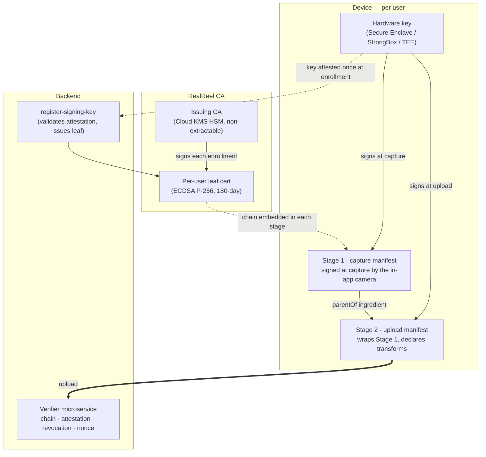

# RealReel Trust Architecture

How RealReel proves a photo or video was captured by a genuine RealReel app on a
hardware-attested device and hasn't been edited since — and what that guarantee
does and doesn't cover.

## The trust claim

Every photo and video posted to RealReel carries an embedded
[C2PA](https://c2pa.org/) manifest signed by a hardware-bound key. The key is
generated inside the device's Secure Enclave (iOS) or hardware-backed Android
Keystore — StrongBox where available, TEE (TrustZone) otherwise; software-only
keystores are rejected at enrollment. It's attested by Apple App Attest or Google
Key Attestation **once at enrollment**, and wrapped in a certificate issued by
RealReel's own Certificate Authority (root key offline; issuing key
non-extractable inside a Cloud KMS HSM).

The claim a signed RealReel photo makes is:

> *This content was captured by an unmodified RealReel app on a device that
> passed hardware attestation at enrollment, signed by a key that has never left
> secure hardware, transformed at upload only through actions the verifier
> explicitly permits, and has not been edited since.*

RealReel attests the *device at enrollment* and the *app at every upload* — the
same shape Pixel and iOS App Attest use ([Why this shape](#why-this-shape--pixel-as-precedent)).

## How it works

Three anchors. The hardware key on each device is the root of attestation for
content. The RealReel CA is the root of identity for the certificate that wraps
that key. The verifier microservice is the gate that decides whether content
enters the platform.



### Enrollment — once per device

The first time a user signs in on a device:

1. The app generates a non-extractable ECDSA P-256 key in secure hardware.
2. The platform attests it — App Attest on iOS; Google Key Attestation on
   Android, which also gates on a **minimum OS patch level**.
3. The app sends a CSR plus the attestation to the `register-signing-key`
   function, which validates the attestation chain, issues a leaf certificate via
   the RealReel CA, and records the device's public key(s) keyed by certificate
   serial.

This is the only point platform attestation runs. Everything downstream relies on
the enrolled key's signature plus, at upload, a fresh app-integrity check.

### Capture (Stage 1)

The in-app camera signs each capture once with the enrolled key. The Stage 1
manifest binds itself to the original file bytes (`c2pa.hash.data` for photos,
`c2pa.hash.bmff` for video), records `c2pa.actions.v2 = [c2pa.created]`, and
carries the leaf certificate chain terminating at the RealReel CA root.

### Upload (Stage 2)

RealReel resizes and compresses every upload (to keep backend storage in check)
and lets the user rotate it. Those transforms change the file's bytes, so the
original capture signature can no longer cover the final image. Rather than throw
that provenance away, the app **wraps** the upload: it re-signs a Stage 2 manifest
with the enrolled key that **declares exactly which transforms it applied**
(resize / rotate / transcode / optional GPS redaction) and preserves the original
capture verbatim as a `parentOf` ingredient. Stage 2 also embeds a
platform-attestation envelope bound to a fresh server-issued challenge and the
enrolled key.

Two independent things are being proven here, and it's worth keeping them
separate. **Content integrity** — that the active manifest covers the exact
uploaded bytes — is enforced by the **manifest signature** and c2pa-rs's hard
binding (`c2pa.hash.data` for photos, `c2pa.hash.bmff` for video) in the Reader:
any post-signing edit breaks that binding. The **platform attestation** does not
re-bind content; it proves **build integrity and nonce freshness** — that the
signer is an unmodified app build answering a fresh server challenge.

This applies to every upload — a RealReel-native capture or a third-party trusted
camera (today: Pixel) alike — so the original capture always rides along as the
trusted Stage 1 parent while Stage 2 records what changed.

The verifier then:

- looks up the key by certificate serial and rejects any revoked key;
- validates the attestation envelope — an App Attest assertion verified locally
  on iOS, or a Play Integrity token decoded via Google's API on Android (requiring
  a hardware-backed `MEETS_STRONG_INTEGRITY` verdict on Android 13+);
- burns the single-use challenge nonce (anti-replay);
- confirms the Stage 2 chain to the RealReel CA, that the actions are on the
  allowlist, and that the content hash matches the uploaded bytes.

Only RealReel-signed active manifests are accepted (**force-wrap**): a raw
foreign-issuer upload is rejected. Trusted third-party captures are validated as
wrapped Stage 1 *parents* against their own trust anchor.

### Trusted timestamps

A signature says *who* signed, not *when*. RealReel anchors the "when" with
RFC 3161 trusted timestamps so a capture stays verifiable after its signing
certificate has expired — the same long-term-validation idea as PAdES-LTA /
CAdES-LTA and Pixel's on-device hardware timestamp. Online captures are stamped
inline; offline captures are queued and stamped on next connectivity. The
verifier validates each signing certificate **as of** its trusted timestamp,
rather than only at upload time.

## Verify a RealReel photo yourself

Anyone with [`c2patool`](https://github.com/contentauth/c2pa-rs/tree/main/cli) installed can
inspect and verify a RealReel file:

```bash
# Show the manifest (no trust check)
c2patool path/to/realreel-photo.jpg

# Verify the certificate chain against the RealReel root (shipped in this repo).
c2patool path/to/realreel-photo.jpg trust \
  --trust_anchors verifier/trust-sources/realreel/root.pem
```

A RealReel file carries two stacked manifests — a Stage 1 capture manifest (the
`parentOf` ingredient) and a Stage 2 upload manifest (the active one). A trusted
verify prints `validation_state: Trusted` for both. RealReel is not yet on the
public C2PA Trust List, so third-party verifiers without the root will report
`signingCredential.untrusted` — expected until that publication.

## Multi-source trust

Most phones don't yet produce C2PA-signed photos — which is why RealReel ships its
own in-app C2PA camera. The verifier isn't RealReel-only by design, though: trust
is keyed off **root certificates**, so any camera that captures genuine C2PA
content can be trusted by adding its root to the trust list.

Today the list has two sources, distinguished by who signed the **Stage 1**
capture:

- **RealReel native** — Stage 1 signed by the RealReel CA.
- **Google Pixel** — Stage 1 signed by Google's C2PA Content Credentials root,
  trusted as a wrapped Stage 1 parent.

As more cameras ship native C2PA, their roots can be added the same way — a root
PEM, a dispatcher entry, and a verification policy (see
[`verifier/README.md`](./verifier/README.md)). The trust list is declarative
(`verifier/trust-sources.yaml` + `trust-core`'s `TRUSTED_ISSUERS`), so the client
gate and the server verifier can't drift on what counts as a trusted capture.

Every upload still carries a RealReel Stage 2 (see [Upload (Stage 2)](#upload-stage-2)) —
so a third-party capture is trusted as the **Stage 1 parent**, while RealReel's
Stage 2 records the resize / compress / rotate applied at upload.

## What it defends against

| Threat | How it's addressed |
|---|---|
| Edit a photo and upload the edited version | Stage 2 binds the active manifest to the uploaded bytes; any change invalidates verification. |
| Upload edited content via a non-RealReel app | Force-wrap: the verifier rejects any active manifest not signed by the RealReel CA. |
| Forge a leaf certificate | The issuing CA is HSM-resident and non-extractable; every certificate chain is validated end-to-end. |
| Enroll a modified app build | App Attest / Google Key Attestation binds enrollment to an unmodified, code-signed app. Modified builds cannot enroll. |
| Sign uploads from a repackaged build | Stage 2 attestation rejects repackaged / non-Apple-signed builds — App Attest verifies the on-disk app package against genuine Apple hardware, and Google returns an unrecognized-version verdict. |
| Extract the device signing key | The key never leaves secure hardware, even with root access. **Bootloader unlock wipes it**; re-enrollment then fails attestation. |
| Replay a previously-uploaded manifest | Each upload binds a fresh server nonce, burned atomically on accept; a replay fails as `ATTESTATION_REPLAY`. |
| Cross-device token replay | The challenge is minted bound to a registry-owned key, so a token for device A can't be redeemed by device B. |
| Stale Android firmware | A patch-level gate at enrollment, plus a hardware-backed `MEETS_STRONG_INTEGRITY` verdict (Android 13+) at upload. |
| Compromised or lost device | A revocation denylist — the verifier rejects any upload signed by, or whose capture references, a revoked key. Immediate, independent of token TTL. |
| Backdated signatures | Trusted RFC 3161 timestamps anchor each signature to an independent clock; the verifier validates each certificate as of its timestamp (an upper-bound proof of when the signature was made). |
| Sensor-level deepfake (point a camera at a screen) | Out of scope for app-based C2PA — see [Scope and assumptions](#scope-and-assumptions). |

## Scope and assumptions

- **App-based, enrollment-time attestation.** Trust is established when a device
  enrolls — its hardware key is attested once — and re-checked for app integrity
  on every upload ([Why this shape](#why-this-shape--pixel-as-precedent)). It is
  not sensor-anchored, and it does not re-attest device health on every capture.
- **Hardware protects key *extraction*, not arbitrary *use*.** The signing key
  cannot be extracted from secure hardware. A device compromised *after*
  enrollment can still be made to use that key — the same residual class Pixel and
  App Attest accept. Bootloader unlock wipes the key and blocks re-enrollment.
- **"Unedited" after an upload transform rests on app integrity.** The app applies
  only declared transforms (resize / rotate / transcode) before upload; the
  assurance that it applied *only* those rests on the upload-time app-integrity
  attestation, not a pixel-level re-hash of the original capture.
- **Platform asymmetry.** Android upload integrity uses a hardware-backed device
  verdict (STRONG); iOS attests app-binary integrity but has no equivalent
  device-state verdict.
- **Sensor-level deepfakes are out of scope.** Pointing a genuine camera at a
  screen defeats any app-based C2PA scheme; defending it requires sensor-anchored
  attestation, a different class of solution.

Found something that isn't captured here? Please report it privately via
[`SECURITY.md`](./SECURITY.md).

## Why this shape — Pixel as precedent

The "attest at enrollment, trust the key downstream" model isn't novel: it's what
Pixel's C2PA Content Credentials camera and iOS App Attest both do. The signing
key is attested at issuance and then trusted to sign without re-attesting device
health on every event.

What Pixel has that RealReel does not:

- A **Titan M2 secure element** — a dedicated hardware root of trust audited at a
  high Common Criteria assurance level. RealReel's key lives in general Secure
  Enclave / StrongBox / TEE: same residual class, lower assurance tier.
- A **hardware-rooted timestamp** in silicon, offline at the moment of capture.
  RealReel uses external RFC 3161 timestamping authorities instead.
- A **C2PA Assurance Level 2 audit**, and a **vendor-owned end-to-end stack** —
  Google ships the SoC, the OS, the camera, and the trust chain as one. RealReel
  is an app on someone else's OS.

Same architectural choice; lower assurance tier; defensible because the
assumptions are explicit.

## Where to look

| Surface | Location |
|---|---|
| Shared trust list, action policies, manifest shapes | `trust-core/` |
| Verifier microservice | `verifier/` |
| Native capture-signing (iOS / Android) | `native/` |
| Enrollment / CA + attestation validators | `ca/` |

For the verifier's trust-list format, single-profile dispatch, and deployment,
see [`verifier/README.md`](./verifier/README.md).
